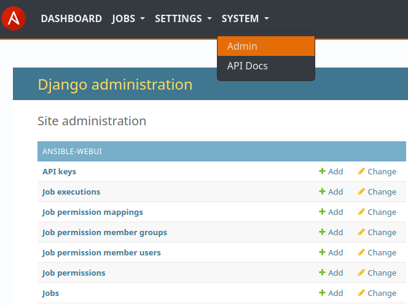
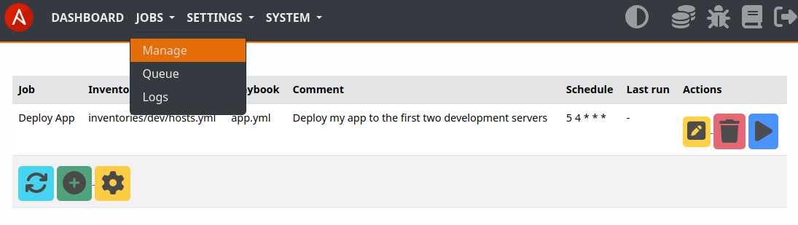

.. _usage_config:

.. include:: ../_include/head.rst

.. include:: ../_include/warn_develop.rst

==========
3 - Config
==========

WebUI
*****

Most configuration can be managed using the WebUI.

Jobs
====

Jobs can be managed at the :code:`Jobs - Manage` page.

|cnf_jobs|

Permissions, Users, Groups
==========================

See: :ref:`Usage - Privileges <usage_permission>`

Administration
==============

As this project is still in its early stages, there are no fancy forms to manage some 'good-to-have' settings yet.

You can use the :code:`System - Admin` page to administer those using the Django administration tool:

|cnf_admin|

----

Environmental variables
***********************

* **AW_SECRET**

   Define a secret key to use for cookie and password encryption.
   By default it will be re-generated at service restart.
   It **has to be set** for job-secrets like passwords to be loadable after restart.
   It has to be **at least 30 characters** long!

* **AW_ADMIN**

   Define the user-name for the initial admin user.

* **AW_ADMIN_PWD**

   Define the password for the initial admin user.

* **AW_PATH_LOG**

   Define the path where full job-logs are saved. Default: :code:`${HOME}/.local/share/ansible-webui/`

* **AW_PATH_RUN**

   Base directory for `Ansible-Runner runtime files <https://ansible.readthedocs.io/projects/runner/en/latest/intro/>`_. Default: :code:`/tmp/ansible-webui/`

* **AW_PATH_PLAY**

   Path to the `Ansible base/playbook directory <https://docs.ansible.com/ansible/2.8/user_guide/playbooks_best_practices.html#directory-layout>`_. Default: current working directory (*when executing ansible-webui*)

* **AW_RUN_TIMEOUT**

   Timeout for the execution of a playbook in seconds. Default: 3.600 (1h)
   You might want to lower this value to a sane value for your use-cases.

* **AW_SESSION_TIMEOUT**

   Timeout for WebUI sessions in seconds. Default: 43.200 (12h)

* **AW_PROXY**

   Set if Ansible-WebUI is operated behind a proxy-server.

* **AW_HOSTNAMES**

   Set a comma-separated list of hostnames that are in use and should be trusted.

* **AW_SERVE_STATIC**

   If defined - the built-in static-file serving is disabled.
   Use this if in production and a `proxy like nginx <https://docs.nginx.com/nginx/admin-guide/web-server/serving-static-content/>`_ is in front of the Ansible-WebUI webservice.

   Path to serve: :code:`/static/ => ${PATH_VENV}/lib/python${PY_VERSION}/site-packages/ansible-webui/aw/static/`

* **AW_DB**

   Define the path where the SQLite3 database is placed. Default: :code:`${HOME}/.config/ansible-webui/aw.db`

* **AW_SSH_KNOWN_HOSTS**

   Define the path to the known-hosts file that should be used. You can use :code:`${AW_PATH_PLAY}` to reference paths relative to your playbook base-directory!

   Default: None - fallback to user defaults

   Default in docker: :code:`${AW_PATH_PLAY}/known_hosts`

* **AW_TIMEZONE**

   Override the timezone used.
   Default is the system timezone.

* **AW_DB_MIGRATE**

   Define to disable automatic database schema-upgrades.
   After upgrading the module you might have to run the upgrade manually:

   .. code-block:: bash

       python3 -m ansible-webui.manage makemigrations
       python3 -m ansible-webui.manage makemigrations aw
       python3 -m ansible-webui.manage migrate

* **AW_ENV**

   Used in development.
   If unset or value is neither 'dev' nor 'staging' the webservice will be in production mode.
   'staging' mode is close to production behavior.

* **AW_DOCKER**

   Used to notify the software that it is running inside a docker container. Needed for listen port.
