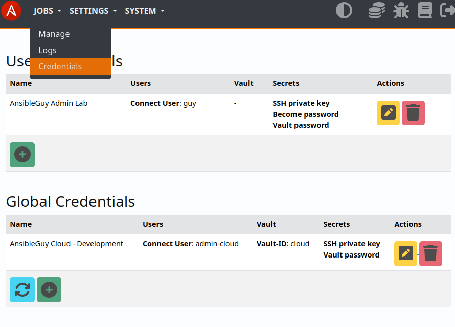
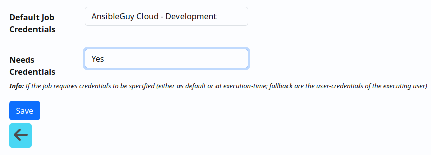
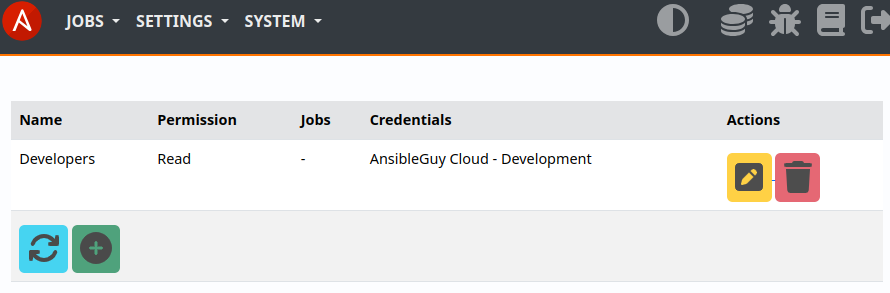

.. _usage_credentials:

.. include:: ../_include/head.rst

.. include:: ../_include/warn_develop.rst

===========
Credentials
===========

You can define :code:`global` and :code:`user` credentials.

The saved credential secrets are never returned to the user/Web-UI! They are saved encrypted to the database!

The UI at :code:`Jobs - Credentials` allows you to manage them.

|creds_ui|

Global Credentials
******************

Global credentials can be used for scheduled job executions.

Users that are members of the :code:`AW Credentials Managers` group are able to create and manage global credentials.

Access to global credentials can be controlled using :ref:`permissions <usage_permission>`.

|creds_perm|

----

User Credentials
****************

User credential can only be used and accessed by the user that created them.

Jobs that are executed by an user will use the first user-credentials found as a fallback in case no other credentials were provided/configured (*but the job is set to need credentials*)!

----

Jobs
****

You can define if a job needs credentials to run in its settings:

|creds_job|
