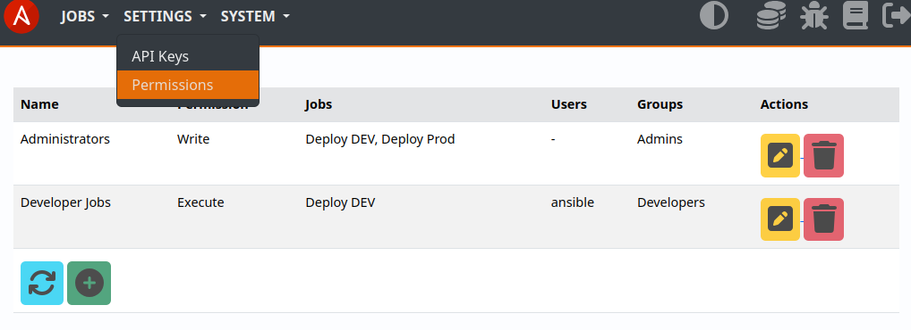
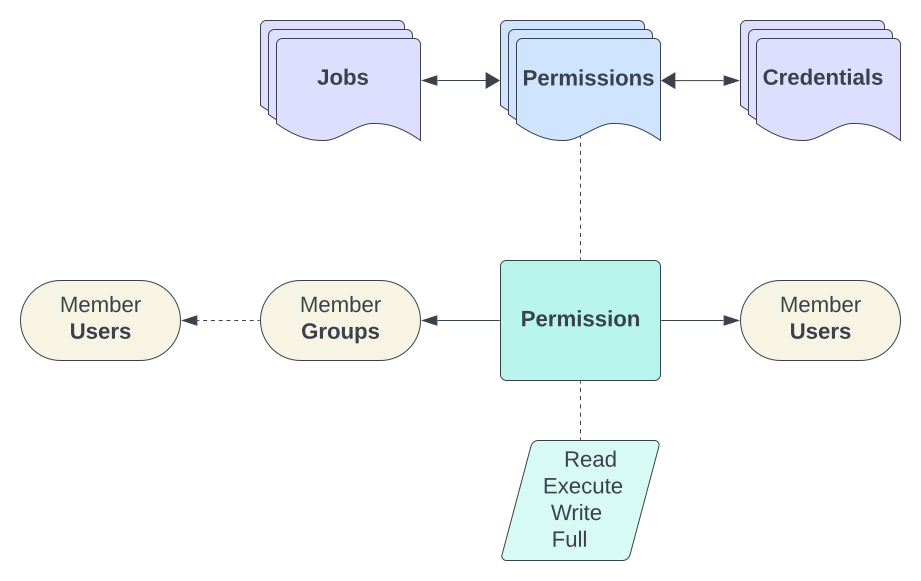

.. _usage_permission:

.. include:: ../_include/head.rst

.. include:: ../_include/warn_develop.rst

.. |perm_users_groups| image:: ../_static/img/permission_users_groups.png
   :class: wiki-img

==========
Privileges
==========

You can set permissions to limit user actions.

Users & Groups
**************

The :code:`System - Admin - Users/Groups` admin-page allows you to create new users and manage group memberships.

Users can change their own password at :code:`System - Password`

The :code:`Superuser` flag can be used to grant all privileges to a user.

|perm_users_groups|

----

Managers
********

To allow a users to perform management actions - add them to the corresponding system-group.

Available ones are:

* :code:`AW Job Managers` - create new jobs, view and update all existing ones

* :code:`AW Permission Managers` - create, update and delete permissions

* :code:`AW Repository Managers` - create new repositories, view and update all existing ones

* :code:`AW Credentials Managers` - create new global credentials, view and update all existing ones

* :code:`AW System Managers` - configure system settings

----

Permissions
***********

The UI at :code:`Settings - Permissions` allows you to create job, credential & repository permissions and link them to users and groups.

|perm_ui|

Each job, credential & repository can have multiple permissions linked to it.

**Permission types:**

* **Read** - only allow user to read job and job-logs
* **Execute** - allow user to start & stop the job + 'Read'
* **Write** - allow user to modify the job + 'Execute'
* **Full** - allow user to delete the job + 'Write'

|perm_overview|
