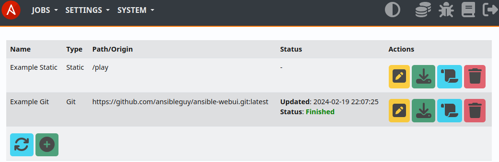

.. _usage_repositories:

.. include:: ../_include/head.rst

.. include:: ../_include/warn_develop.rst

============
Repositories
============

By default the static Repository set by :code:`AW_PATH_PLAY` is used.

You are able to create multiple Repositories that act as Ansible-Playbook base-directories.

|repo_ui|

Static
******

Absolute path to an existing local static directory that contains your `playbook directory structure <https://docs.ansible.com/ansible/2.8/user_guide/playbooks_best_practices.html#directory-layout>`_.

----

Git
***

Git repositories are also supported.

They can either be updated at execution or completely re-created (*isolated*).
