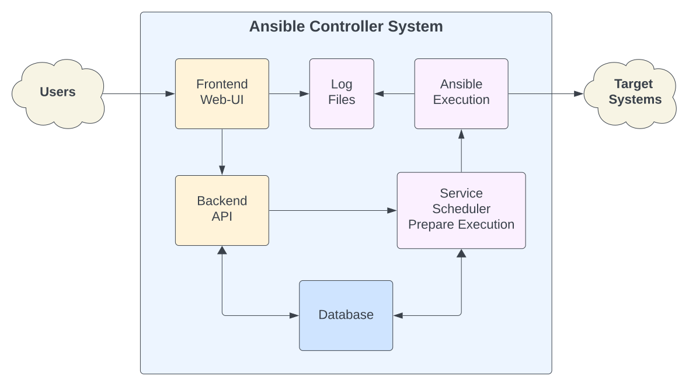

.. _usage_troubleshooting:

.. include:: ../_include/head.rst

.. include:: ../_include/warn_develop.rst

===============
Troubleshooting
===============

Topology
********

AnsibleGuy WebUI is made of a few main components.

It will be beneficial for the troubleshooting process if we find out in which the error occurs.

|ts_sys_ov|

----

Debugging
*********

You can enable the debug mode at the :code:`System - Config` page.

If that is not possible you can alternatively set the :code:`AW_DEBUG` environmental variable.

This debug mode **SHOULD ONLY BE ENABLED TEMPORARILY**! It could possibly open attack vectors.

You might need to restart the application to apply this setting.

----

Versions
********

You can find the versions of software packages in use at the :code:`System - Environment` page.

Alternatively you can check it from the cli: :code:`python3 -m ansibleguy-webui.cli --version`

----

Job Execution
*************

If you want to troubleshoot a job execution, you will have to find out if it is an issue with Ansible or the WebUI system.

The Ansible execution itself can fail because of some common issues:

* Unable to connect

  * Network issue
  * Wrong credentials supplied
  * Target system is mis-configured

* Controller dependencies

  * Ansible needs Python Modules and in some cases Ansible Collections and Ansible Roles to function correctly

    These need to be installed and should be up-to-date.

    You can find the current versions used by your Controller system at the :code:`System - Environment` page

  * If you are using Docker - you can install those dependencies using requirements-files. See :ref:`Usage - Docker <usage_docker>`

* to be continued..

----

Common Issues
*************

----

SSH Hostkey Verification
========================

**Error**: While executing Ansible you see: :code:`Host key verification failed`

**Problem**:

* SSH has a security feature that should keep you safe from `man-in-the-middle attacks <https://en.wikipedia.org/wiki/Man-in-the-middle_attack>`_ which could allow the attacker to take over your SSH account/credentials.

  See also: `Ansible Docs - Hostkey Verification <https://docs.ansible.com/ansible/latest/inventory_guide/connection_details.html>`_

* As this security feature is important you **SHOULD NOT DISABLE IT IN PRODUCTION** by adding the environmental variable `ANSIBLE_HOST_KEY_CHECKING=False` to your jobs!

* In production you might want to either:

  * Maintain a `list of known-good hostkeys <https://en.wikibooks.org/wiki/OpenSSH/Client_Configuration_Files#~/.ssh/known_hosts>`_

    You can specify which :code:`known_hosts` file AW should use, using the config setting :code:`AW_SSH_KNOWN_HOSTS`

  * Implement `CA signed-hostkeys <https://access.redhat.com/documentation/en-us/red_hat_enterprise_linux/6/html/deployment_guide/sec-creating_ssh_ca_certificate_signing-keys>`_

----

Python Module not installed
===========================

**Error**: While executing Ansible you see: :code:`No module named '<MODULE>'`

**Problem**:

* Your Ansible controller system is missing a required Python3 module!

* If you are NOT using Docker, you can install it manually using PIP: :code:`python3 -m pip install <MODULE>`

  You could also find and install the module using your systems package manager: :code:`sudo apt install python3-<MODULE>` (NOTE: these packages are older versions)

* If you are using Docker, you can create and mount a :code:`requirements.txt` and restart your container. See also: :ref:`Usage - Docker <usage_docker>`

----

Edge-Case Issues
****************

----

Connection in use
=================

**Error**: While starting AW you see: :code:`Connection in use: ('127.0.0.1', 8000)`

**Problem**

* Make sure no other process is binding to port 8000: :code:`netstat -tulpn | grep 8000`

  If that is the case - you can set the :code:`AW_PORT` env-var to change the port to be used.

* The app failed last time. There is still an old process running. If this happens repeatedly - open an issue!

  You can find and kill it:

  .. code-block:: bash

      # find it
      pgrep -f ansibleguy-webui
      netstat -tulpn | grep 8000
      ps -aux | grep ansibleguy-webui | grep -v grep

      # kill it
      pkill -f ansibleguy-webui
      kill -9 <PID>

----

Database is locked
==================

**Error**: The Web interface shows a plain :code:`Error 500` and the console shows :code:`django.db.utils.OperationalError: database is locked`

**Problem**:

* I've encountered this issue a few times. It occurs because the `SQLite database is locked by a write-operation <https://github.com/ansibleguy/webui/issues/6>`_.

  Restarting the application is the easiest way of working around it.

  If it occurs more often - please open an issue!

* If you are running many jobs - you could try to keep a minute between their scheduled executions.

----

Too Many Log Files exist
========================

**Error**: Job logs are currently not cleaned automatically. You may want to clean them manually periodically.

**Resolution**:

* You can easily remove all log-files older than N days with this command:

.. code-block:: bash

    MAX_LOG_AGE=7  # days
    cd ~/.local/share/ansible-webui/
    find -type f -mtime +${MAX_LOG_AGE} -delete

----

Database Migration Issues
=========================

*Note: This is a general guide on how to handle Django migration issues. It could also be helpful if you are running another Django app.*

**Error**: After a version upgrade you see :code:`django.db.utils.OperationalError: no such column` or even :code:`django.db.utils.OperationalError: no such table`

**Problem**:

* It seems the database schema was not upgraded. This is normally done automatically at application startup.

* You can try to execute the migrations manually:

  * Stop the application

  * Enter the application context & try to upgrade

    .. code-block:: bash

        # when running as local service-user
        su <SERVICE-USER> --login --shell /bin/bash

        # when running in docker
        docker exec -it ansible-webui /bin/sh

        # set the path to your database
        export AW_DB=<PATH-TO-YOUR-DB>

        # upgrade DB schema
        python3 -m ansibleguy-webui.manage migrate

----

**Error**: While running the database schema upgrade you see :code:`django.db.utils.OperationalError: duplicate column name` or :code:`django.db.utils.OperationalError: duplicate table name`

**Problem**:

* This should never happen if you are running a release version (*AW_ENV=prod*) and did not already run migrations manually.

* Make sure you set the :code:`AW_DB` env-var correctly before running the migrations.

* You will have to find out which migrations were already applied:

  :code:`python3 -m ansibleguy-webui.manage showmigrations`

  * Or check your database manually:

      .. code-block:: bash

          sqlite3 <PATH-TO-YOUR-DB>
          SELECT name,applied FROM django_migrations WHERE app = "aw";

  * You can also check the current schema of the table you see mentioned in the error message

      .. code-block:: bash

          sqlite3 <PATH-TO-YOUR-DB>
          .table
          .schema <TABLE>

* Check which migrations are available: :code:`python3 -m ansibleguy-webui.cli -a migrations.list`

* With that information you should be able to determine which migrations you can :code:`fake` and which ones to apply.

    .. code-block:: bash

        # migrations that are available and already are applied to the database - can be faked (only last one)
        python3 -m ansibleguy-webui.manage migrate --fake aw 0001_v0_0_12

        # you should then be able to apply the un-applied migrations
        python3 -m ansibleguy-webui.manage migrate aw 0002_v0_0_13
